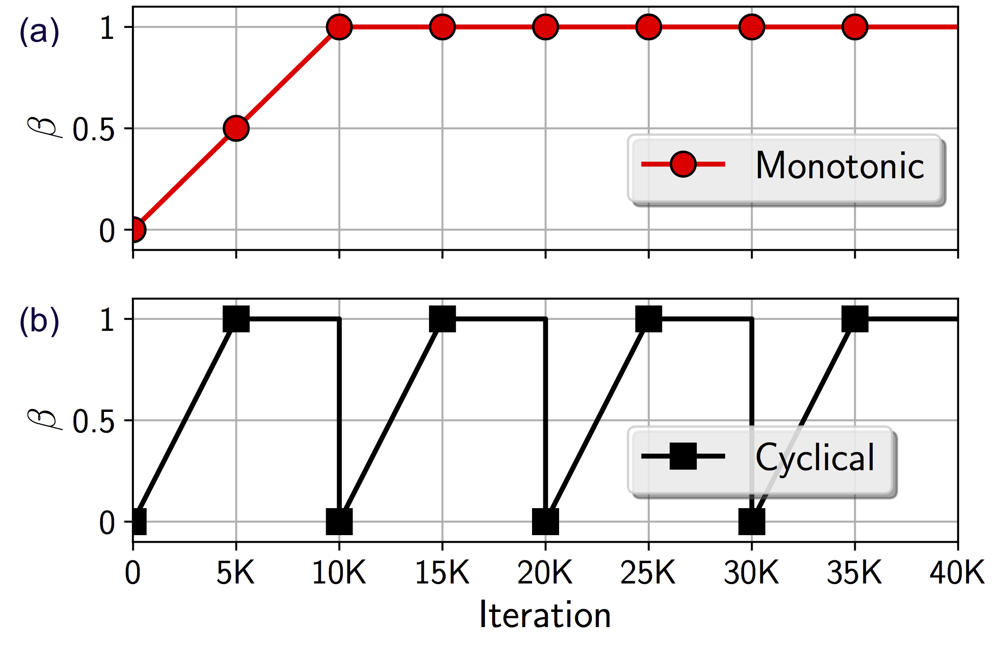
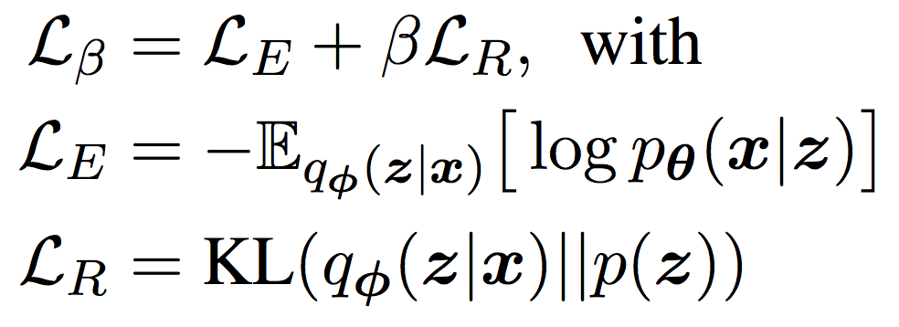
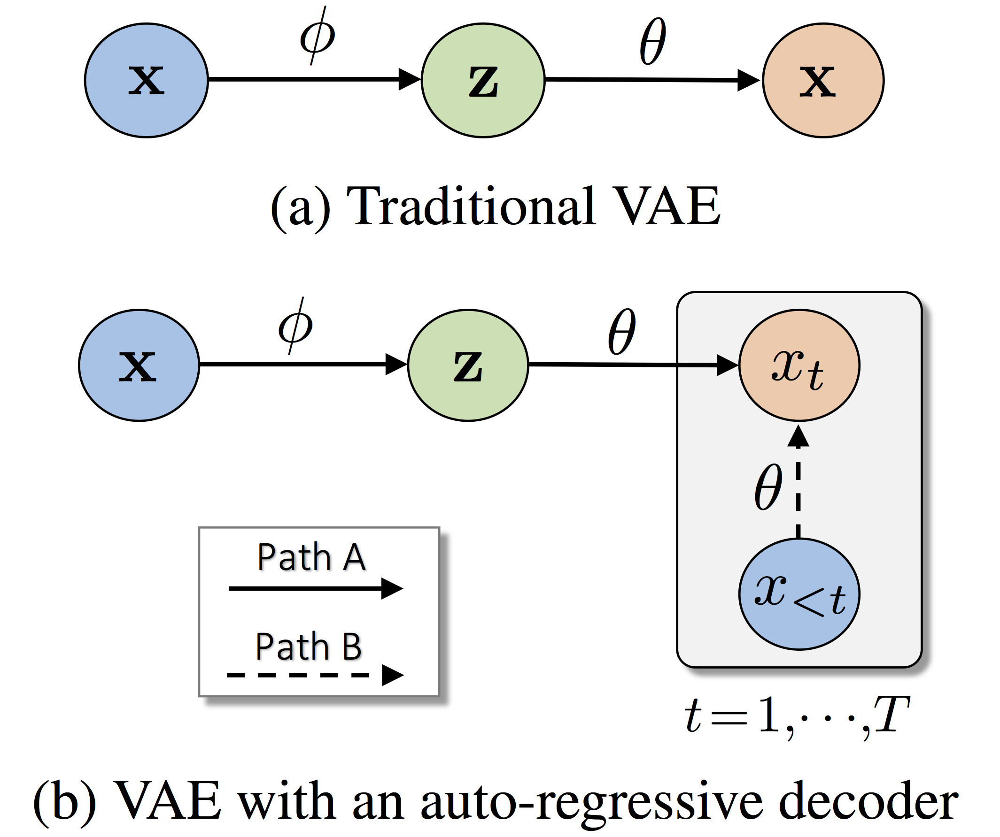
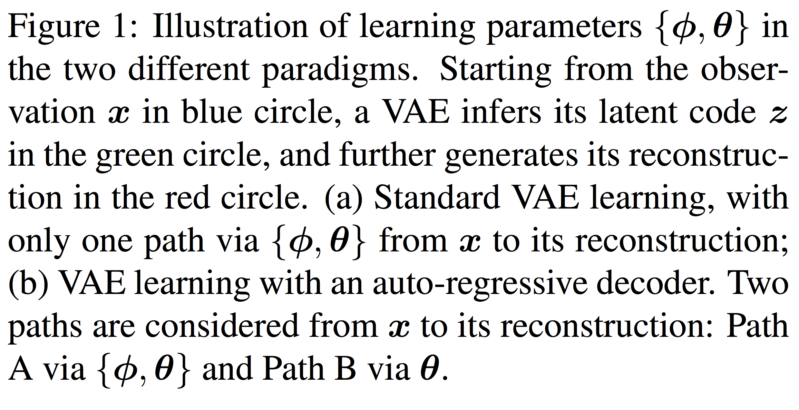
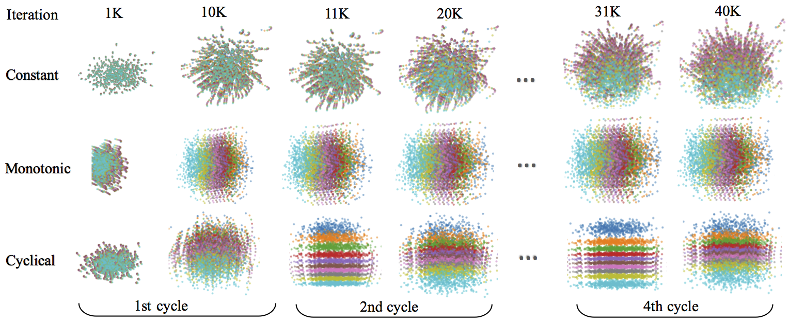
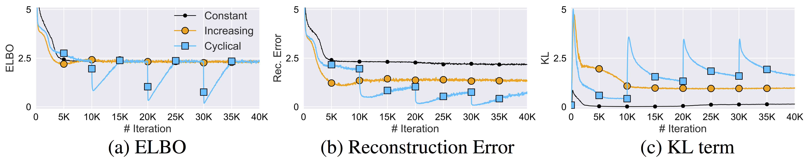

# Cyclical Annealing Schedule: A Simple Approach to Mitigating KL Vanishing


This repository contains source code to reproduce the results presented in the paper [Cyclical Annealing Schedule: A Simple Approach to Mitigating KL Vanishing](https://arxiv.org/abs/1903.10145) (NAACL 2019):

```
@inproceedings{fu_cyclical_2019_naacl,
  title={Cyclical Annealing Schedule: A Simple Approach to Mitigating {KL} Vanishing},
  author={Hao Fu, Chunyuan Li, Xiaodong Liu, Jianfeng Gao, Asli Celikyilmaz, Lawrence Carin},
  booktitle={NAACL},
  year={2019}
}
```

<p align="center">

| β schedules | The VAE objective, augmented with β 
|:-------------------------:|:-------------------------:
 |   

</p>

Comparison between (a) traditional monotonic and (b) proposed cyclical annealing schedules. 

The objective of **Variational Autoencoders (VAEs)** is the ELBO of log p(x) (ie, β=1): Learning an informative latent feature z ~ q(z|x) to represent the observation x, while regularized towards the latent prior p(z). 
However, when trained with a constant schedule β=1, the KL term L_R vanishes to 0, leading to the **KL vanishing** issue. The proposed cyclical schedule is introduced to dynamically change the value of  β during training; It has two hyper-parameters: 1)  *M*: the number of cyclles; and 2) *R*: the proportion used to increase β (and 1-R used to fix β).  In this figure, M=4 cycles are illustrated, R=0.5 of a cycle is used for increasing β.


### Two-path interpretation for VAE with an auto-regressive decoder

|    |  
|:-------------------------:|:-------------------------:

In the 2nd and its following cycles, β=0 re-opens Path B, allowing the high quality latent codes learned the previous cycle to train the decoder.

Sample code to construct a (linear) cyclical schedule (e.g. M=4 & R=0.5):

```python

def frange_cycle_linear(n_iter, start=0.0, stop=1.0,  n_cycle=4, ratio=0.5):
    L = np.ones(n_iter) * stop
    period = n_iter/n_cycle
    step = (stop-start)/(period*ratio) # linear schedule

    for c in range(n_cycle):
        v, i = start, 0
        while v <= stop and (int(i+c*period) < n_iter):
            L[int(i+c*period)] = v
            v += step
            i += 1
    return L 
```

Please see more schedule examples [here](plot/plot_schedules.ipynb).


## Contents
There are two steps to use this codebase to reproduce the results in the paper.

1. [Visualization of Latent Space](#Visualization-of-Latent-Space)

2. [Experiments](#experiments)
    
    2.1. [Language Modeling](#language-modeling)
    
    2.2. [Dialog Response Generation](#dialog-response-generation) 

    2.3. [Unsupervised Language Pre-training](#Unsupervised-Language-Pre-training)

3. [Reproduce paper figure results](#reproduce-paper-figure-results) 


## Visualization of Learning Dynamics in the Latent Space

A synthetic dataset of 10 sequences are considered for VAEs.
We visualize the resulting division of the latent space, where each color corresponds to z ~ q(z|n), for n = 1,··· ,10. 

|   
|:-------------------------:
|   

## Language Modeling

All language model code and data are at [`language_model`](./language_model):

Dependencies: This code is based on `Python 3.6`, with the main dependencies being [Pytorch==0.2.0](https://pytorch.org/). We also require the `h5py` package for preprocessing.

Preprocess the raw data before running:

```
python preprocess_text.py --trainfile data/ptb/train.txt --valfile data/ptb/val.txt --testfile data/ptb/test.txt --outputfile data/ptb/ptb
```

For vae model with cyclical annealing, the command is:

```
python train_text_bl_ptb.py --model vae --log_dir logs/ptb/vae_bl
```

For vae model with monotonic annealing, the command is:

```
python train_text_cyc_ptb.py --model vae --log_dir logs/ptb/vae_cyc
```

It takes the following options (among others) as arguments:

- `--model` It specifies types of langauge model; default `vae`.  
- `--log_dir` Address to save the training log.
- For other arguements, please refer to the github repo [sa-vae](https://github.com/harvardnlp/sa-vae)

To run savae model, replace `vae` in `--model` and `--log_dir` with `savae`


## Dialog Response Generation

All dialog response generation code is at [`dialog`](./dialog):

Dependencies: This code is based on `Python 2.7`, with the main dependencies being [TensorFlow==1.4.0](https://www.tensorflow.org/). You may need to `pip install -U nltk` and `pip install beeprint` if the module is missing.

Use pre-trained Word2vec: Download Glove word embeddings from [here](https://nlp.stanford.edu/projects/glove/) and put it under [`dialog`](./dialog). The default setting use 200 dimension word embedding trained on Twitter.

1. Training:

To train with different setup, run with one of the command:

  - cyclical annealing: `python kgcvae_swda_cyc_elbo.py`
  - monotonic annealing: `python kgcvae_swda_bl_elbo.py`
  - cyclical annealing + bag-of-words loss: `python kgcvae_swda_cyc.py`
  - monotonic annealing + bag-of-words loss: `python kgcvae_swda_bl.py`

2. Testing:

After training with any setup, modify the TF flags at the top of the `kgcvae_swda` file as follows:

```forward_only: False -> True```

Then run the same `kgcvae_swda` as training. By default, multi-reference testing will be conducted


## Unsupervised Language Pre-training

All semi-supervised text classification code is at [`semi`](./semi):

Dependencies: This code is based on `Python 2.7`, with the main dependencies being [TensorFlow==1.4.0](https://www.tensorflow.org/). You may need to `pip install -U scikit-learn` if the module is missing.

1. Unsupervised Pretraining

To run with different setup, run with one of the command:

  - ae: `python semi_yelp_ae_pre.py`
  - vae with monotonic annealing: `python semi_yelp_vae_pre.py`
  - vae with cyclical annealing: `python semi_yelp_cyc_pre.py`

2. Supervised Finetuning & Latent Visualization

After pretraining, run with corresponding setup to do fintuning:

  - ae: `python semi_yelp_ae_ft.py`
  - vae with monotonic annealing: `python semi_yelp_vae_ft.py`
  - vae with cyclical annealing: `python semi_yelp_cyc_ft.py`

To visualize latent space, modify the `plot_type` property of Options in `tsne_plot.py` file as follows:
```self.plot_type = 'vae'```

Then run `python tsne_plot.py`.


## Reproduce paper figure results
Jupyter notebooks in [`plot`](./plot) folders are used to reproduce paper figure results.

Note that without modification, we have copyed our extracted results into the notebook, and script will output figures in the paper. If you've run your own training and wish to plot results, you'll have to organize your results in the same format instead.

## Acknowledgements
The implementation in our experiments heavily depends on three NLP applications published on Github repositories: 

- [SA-VAE](https://github.com/harvardnlp/sa-vae)
- [NeuralDialog-CVAE](https://github.com/snakeztc/NeuralDialog-CVAE) 
- [TextCNN_public](https://github.com/dreasysnail/textCNN_public)

We acknowledge all the authors who made their code public, which tremendously accelerates our project progress.

## Questions?
Please drop us ([Hao](https://github.com/haofuml) and [Chunyuan](http://chunyuan.li/)) a line if you have any questions.


